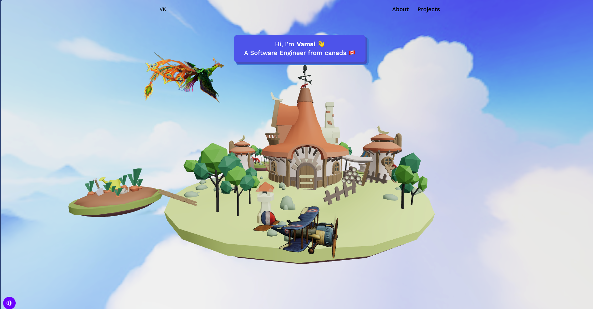

# 3D Portfolio App

This is a 3D portfolio application built with React and Three.js.

## Description

This application is a 3D portfolio showcasing my projects. It's built using React for the UI components and Three.js for the 3D rendering.

## Installation

To install the application, follow these steps:

1. Clone the repository: `git clone https://github.com/your_username/your_repo.git`
2. Navigate into the directory: `cd your_repo`
3. Install the dependencies: `npm install`
4. Start the application: `npm start`

## Usage

To navigate through the 3D portfolio, use the mouse to rotate the view and click on the projects to see more details.

## Author

Bhanu Satyani

If you found this project useful, please consider giving it a ⭐️!

## Contributing

Contributions are welcome. Please open an issue or submit a pull request.

## License

This project is licensed under the MIT License.